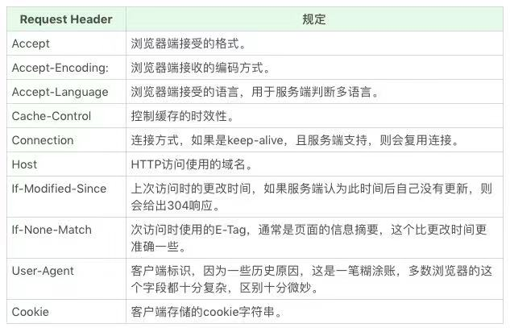
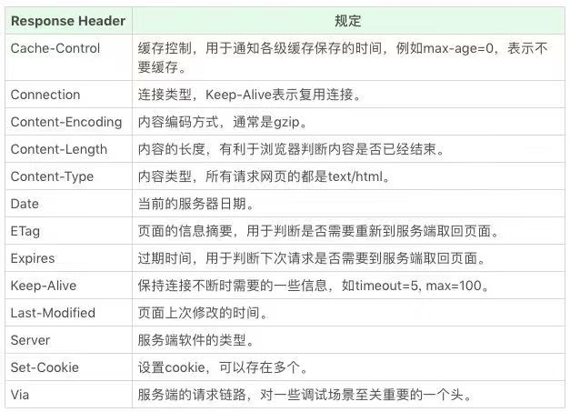
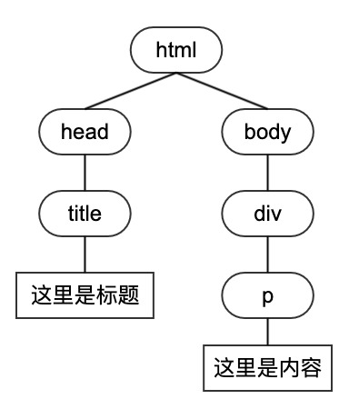
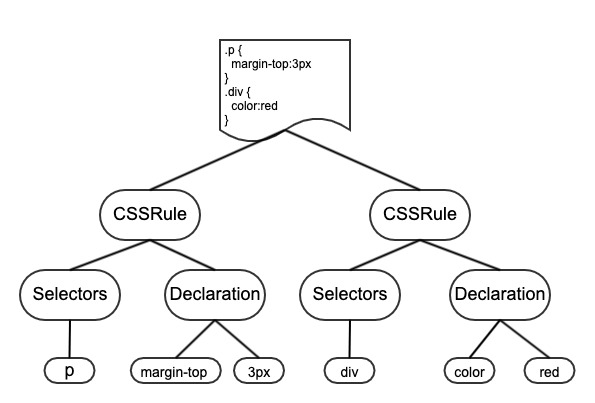

## 序
在地址栏输入了`baidu.com`发生了什么

## 一、DNS 解析
客户端输入 url 后先会问本地 hosts 文件，你有没有`baidu.com`对应服务器 IP 的映射关系呀。
如果 hosts 说有啊，不就是`135.128.111.65`么拿去，拿到 IP 后这次找寻就结束了。
如果 hosts 说没有，那就要问本地 DNS 解析器有没有缓存，如果本地 DNS 解析器说有啊，前几天你刚查过，我这里有记录，拿到 IP 后这次找寻结束。
如果本地 DNS 解析器没有，就要问本地 DNS 服务器（TCP/IP 中设置的首选 DNS 服务器），本地 DNS 找了下自己的配置，说有啊有啊我配的有拿去吧，拿到 IP 后本次找寻结束。
如果本地 DNS 服务器没有配置但缓存了映射关系，那么调用映射，返回 IP，本次找寻结束。

如果以上都没有找到，本地 DNS 会请求根 DNS 找寻：
本地： 嘿，根 DNS，你知道`baidu.com`是谁管的么
根 DNS： 你去找顶级域名服务器 A 吧，它负责管 `.com`
本地： 嘿，A，你知道`baidu.com`是谁管的么
顶级域 A: 你去找第二层域 B 吧，它负责 `baidu.com`
本地： 嘿，B，你知道`baidu.com`谁负责么
二级层域 B：知道呀，`135.128.111.65`就是

至此完成 DNS 解析。
（PS.如果是`www.baidu.com`, 重复上面的查找操作）

[补充: DNS 预解析]
`DNS Prefetching` 是让具有此属性的域名不需要用户点击链接就在后台解析，而域名解析和内容载入是串行的网络操作，所以这个方式能减少用户的等待时间，提升用户体验 。

默认情况下浏览器会对页面中和当前域名（正在浏览网页的域名）不在同一个域的域名进行预获取，并且缓存结果，这就是隐式的 `DNS Prefetch`。如果想对页面中没有出现的域进行预获取，那么就要使用显示 `DNS Prefetch `了。

```bash
//用meta信息来告知浏览器, 当前页面要做DNS预解析
<meta http-equiv="x-dns-prefetch-control" content="on">
在页面header中使用link标签来强制对DNS预解析: 
<link rel="dns-prefetch" href="//www.baidu.com">

```

注意：`dns-prefetch`需慎用，多页面重复DNS预解析会增加重复DNS查询次数，因为有开发者指出 禁用DNS 预读取能节省每月100亿的DNS查询 。

```bash
//如果需要禁止隐式的 DNS Prefetch
<meta http-equiv="x-dns-prefetch-control" content="off">
```

## 二、建立 TCP 连接
这就是著名的三次握手了

客户端：喂喂喂，服务器你在吗，我给你发个 X。
——第一次【SYN=1、ACK=0、seq=X】
服务器：我在我在，我收到你的 X 了，你之后从 X+1 发吧，我给你发个 Y 你能收到么。
——第二次【SYN=1、ACK=1、ack=X+1、seq=Y】
客户端：好的，我这次从 X+1 开始发，我收到你的 Y 了。
——第三次【SYN=1、ACK=1、seq=X+1、ack=Y+1】

至此 TCP 连接建立完成，开始传输数据。


## 三、传输数据

与服务器已建立连接，此时客户端发起 http 请求，取得具体数据。

### 请求报文
一般 HTTP 请求报文有以下四个部分组成：
#### 1. 请求行
- 请求方法（GET、POST、PUT、DELETE、PATCH、HEAD、OPTIONS、TRACE）
- 请求地址（例如：http://baidu.com:80/index ）
> 协议、主机、端口、路径，通常 http 请求端口可省略，默认为 80

- 协议版本（HTTP/1.0、HTTP/1.1、HTTP/2.0）

#### 2. 请求头


#### 3. 请求空行
- 表示请求头结束，下面是请求数据

#### 4. 请求数据
- 可选，如 get 请求可无请求数据


### 响应报文
响应报文也由四个部分组成
#### 1. 状态行
- 协议版本（HTTP/1.0、HTTP/1.1、HTTP/2.0）
- 状态码
     - 1xx:继续处理
     - 2xx:成功【200】
     - 3xx:重定向【304（Not Modified）】
     - 4xx:客户端错误【400（Bad Request）、404（Not Found）、403（Forbidden）、401（Unauthorized）】
     - 5xx:服务端错误【500】
- 状态描述 （对状态码的简单描述）

#### 2. 响应头


#### 3. 响应空行
* 表示响应头结束，下面是响应数据

#### 4. 响应数据
* 以请求`http://baidu.com/index`为例，响应数据为 html 文档

## 四、四次挥手
客户端：我没有要发的报文了，我要关闭连接了
——第一次【FN=1、ACK=0、ack=Z、seq=X】
服务器：我同意，我还没发完，你再等一会。
——第二次【ACK=1、ack=X+1、seq=Z】
服务器：我发完了，可以关闭连接了
——第三次【FN=1、ACK=1、ack=X、seq=Y】
客户端：真的要关了，再见了。
——第四次【ACK=1、seq=X、ack=Y】

至此 TCP 连接断开


## 五、浏览器解析 HTML

#### 1.生成 DOM 树
解析器输出解析树，采用堆栈的方式（遇到开始标签压入，遇到结束标签推出）将 html 文档解析成 dom 树

```javascript
<html>
  <head>
    <title>这里是title</title>
  </head>
  <body>
    <div>
      <p>这里是内容</p>
    </div>
  </body>
</html>

```

解析如下:



#### 2.生成 CSSOM 树




#### 3.合并 DOM 树和 CSSOM 树
合并成渲染树，渲染树只包含渲染网页所需的节点

## 六、布局渲染

根据渲染树计算 CSS 样式，即每个节点在页面中的大小和位置
html 默认是流式布局，这里面有两个重要的概念：
 1. 重排（reflow）： 节点尺寸发生变化
 2. 重绘（repaint）：节点尺寸没变，例如颜色变了，但不影响整体布局
通常说的 dom 操作的优化就是减少reflow和repaint