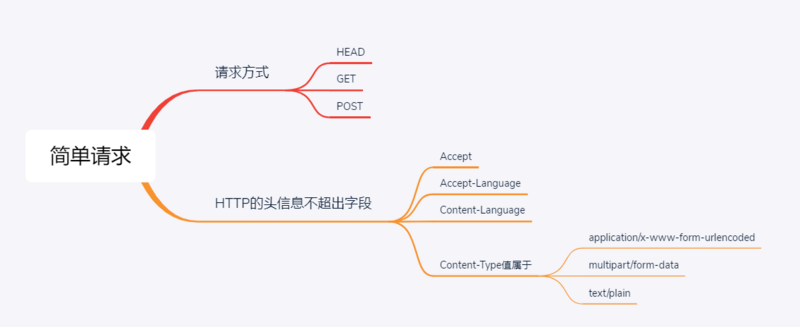

## 序
跨域，相信大家无论是在工作中还是在面试中经常遇到这个问题，常常在网上看到别人所整理的一些方法，看似知道是怎么回事，但如果没有动手实践过，总觉得自己没有真正的掌握，在这里，通过自己认真思考整理一些常用的方法。

## 跨域的产生
相信大家都知道跨域是因为浏览器的同源策略所导致的。所谓同源是指"协议+域名+端口"三者相同，即便两个不同的域名指向同一个ip地址，也非同源。浏览器引入同源策略主要是为了防止XSS，CSRF攻击。
>>> CSRF（Cross-site request forgery），跨站请求伪造，也被称为：one click attack/session riding，缩写为：CSRF/XSRF。

## 跨域的解决方案
### 1.通过jsonp跨域
首先说一下jsonp的原理，例如我们平时写html的时候常常会使用
`<script src="www.b.com/js/jquery.js"></script>`这种方式去取放在另外服务器上的静态资源，这个是不受同源策略所限制的，所以我们利用这一点可以解决跨域的问题。
#### 原生实现
```javascript
//在www.a.com域名写下如下代码，去请求www.b.com域名的数据
var script = document.creatElement('script');
script.type = 'text/javascript';
script.src = 'http://www.b.com/getdata?callback=demo';

function demo(res){
    console.log(res);
}
```
这里，我们利用动态脚本的src属性，变相地发送了一个`http://www.b.com/getdata?callback=demo`,这时候，`b.com`页面接受到这个请求时，如果没有JSONP,会正常返回`json`的数据结果，像这样：`{ msg: 'helloworld' }`,而利用`JSONP`,服务端会接受这个`callback`参数，然后用这个参数值包装要返回的数据：`demo({msg: 'helloworld'})`;

这时候，如果a.com的页面上正好有一个`demo` 的函数：
```javascript
function demo(){
    console.log(res);
}
```
当远程数据一返回的时候，随着动态脚本的执行，这个`demo`函数就会被执行。

#### jquery ajax请求实现
```javascript
//客户端
$.ajax({
    url:'http:127.0.0.1:8001/list',
    method:'get',
    dataType:'jsonp', // 请求方式为jsonp
    success:res=>{
        console.log(res)
    }
})

```

```javascript
//服务器serverJsonp.js
let express = require('express')
app = express()
app.listen(8001,()=>{
    console.log('ok!')
})
app.get('list',(req,res)=>{
    let {} = req.query
    let data = {
        data:0,
        message:''
    }
    res.send('${callback}(${JSON.stringify(data)})')
})

```

### 2.CORS跨域资源共享
所有浏览器都支持该功能，IE浏览器不能低于`IE10`。
#### 2.1 简单请求和非简单请求
浏览器将`CORS`请求分成两类：简单请求`（simple request）`和非简单请求`（not-so-simple request)`.

##### 简单请求同时满足以下条件,只要不满足以下条件的则为非简单请求



#### 2.2 进行带有身份凭证的CORS请求
- 默认情况下的跨域请求都是不会把`cookie`发送给服务器的，在需要发送的情况下，如果是`xhr`，那么需要设置`xhr.withCredentials=true`
- 如果是采用fetch获取的话，那么需要在`request`里面设置 `credentials:'include'`
- 但是如果服务器在预请求的时候没返回`Access-Control-Allow-Crenditials:true`的话，那么在实际请求的时候，cookie是不会被发送给服务器端的，要特别注意对于简单的get请求，不会有预请求的过程
- 那么在实际请求的时候，如果服务器没有返回`Access-Control-Allow-Crenditials:true`的话那么响应结果浏览器也不会交给请求者
对于附带身份凭证的请求，服务器不得设置 `Access-Control-Allow-Origin` 的值为“*”。
这是因为请求的首部中携带了 `Cookie` 信息，如果 `Access-Control-Allow-Origin`
的值为“*”，请求将会失败。而将 `Access-Control-Allow-Origin` 的值设置为
`http://www.a.com`，则请求将成功执行。

####  2.3 HTTP响应首部字段
- `Access-Control-Allow-Origin`: <origin> | *
- `Access-Control-Expose-Headers` 头让服务器把允许浏览器访问的头放入白名单
- `Access-Control-Max-Age` 头指定了preflight请求的结果能够被缓存多久
- `Access-Control-Allow-Credentials` 头指定了当浏览器的`credentials`设置为`true`时是否允许浏览器读取`response`的内容
- `Access-Control-Allow-Methods` 首部字段用于预检请求的响应。其指明了实际请求所允许使用的`HTTP`方法。
- `Access-Control-Allow-Headers` 首部字段用于预检请求的响应。其指明了实际请求中允许携带的首部字段。
#### 2.2 以nodejs express为例，说明如何使用cors解决跨域
```javascript
//server
    var express=require('express');
    var url=require('url');
    var app=express();
    var allowCrossDomain = function(req, res, next) {
        //设置哪个源可以访问我
        res.setHeader('Access-Control-Allow-Origin', 'http://localhost:9001');
        //允许哪个方法访问我
        res.setHeader('Access-Control-Allow-Methods', 'GET,PUT,POST,DELETE');
        //允许携带哪个头访问我
        res.setHeader('Access-Control-Allow-Headers', 'Content-Type');
        //允许携带cookie
        res.setHeader('Access-Control-Allow-Credentials','true');
        //预检的存活时间
        res.setHeader('Access-Control-Max-Age',6);
        //允许前端获取哪个头
        res.setHeader('Access-Control-Expose-Headers','name');
        next();
    };
    app.use(allowCrossDomain);
    app.get('/getData',function (req,res,next) {
        var queryValue=url.parse(req.url).query;
        if(queryValue==='fortunewheel@sina.com'){
            res.send(true);
        }else {
            res.send(false);
        }

    });
    app.listen(3001);

```


### 3.http proxy （http代理）
```javascript
webpack+webpack-dev-server
devServer:{
    proxy:{
        '/':{
            target:'http:127.0.0.1',
            changeOrigin:true    //设置此属性走跨域
        }
    }
}
```


### 4. nginx反向代理
```javascript
server{
    // 监听8080端口
    listen 8080
    // 域名是localhost
    server_name localhost
    // 凡是localhost:8080/api这个样子的，都转发到真正的服务端的地址http://www.b.com:8080
    location ^~ /api{
        proxy_pass  http://www.b.com:8080
    }
}

```
配置之后就不需要前端做什么修改了，一般我们在前后端分离项目中开发阶段会采用这种方式，但不是所有场景都能这样做，例如后端接口是一个公共的`API`，比如一些公共服务获取天气什么的。

### 5. window.postMessage
`postMessage`是`HTML5 XMLHttpRequest Level 2`中的`API`，且是为数不多可以跨域操作的`window`属性之一，它可用于解决以下方面的问题：

- `iframe`嵌套页面跨域通信
- 页面和其打开的新窗口的通信
- 多窗口之间消息传递

用法：
`postMessage(data,origin)`方法接受两个参数，

data：需要传递的数据，html5规范支持任意基本类型或可复制的对象，但部分浏览器只支持字符串，所以传参时最好用`JSON.stringify()`序列化。
origin：协议+主机+端口号，也可以设置为"*"，表示可以传递给任意窗口，如果要指定和当前窗口同源的话设置为"/"。


```javascript
//http://www.a.com/a.html
<ifram id="iframe" src="http://www.b.com/b.html" style="display:none"></iframe>
var iframe = document.getElementById('iframe');
iframe.onload = function(){
    var data = {
        name:'wanglina'
    }
    //向http://www.b.com传递跨域数据
    iframe.contentWindow.postMessage(JSON.stringify(data),'http://www.b.com');
};
```


```javascript
//http://www.b.com/b.html
window.addEventListener('message', function(ev) {    //接收http://www.a.com/a.html的数据
    alert('data from http://www.a.com/a.html---> ' + ev.data);
    var data = JSON.parse(ev.data);
    if (data) {
        data.number = 16;
        // 处理后再发回http://www.a.com/a.html
        // window.parent.postMessage(JSON.stringify(data), 'http://www.a.com');
        ev.source.postMessage(JSON.stringify(data), 'http://www.a.com')
    }
}, false);

```

### 6. document.domain + iframe
这种方式只适合主域名相同，但子域名不同的`iframe`跨域。
实现原理：两个页面都通过`js`强制设置`document.domain`为基础主域，就实现了同域。
使用方式：
```javascript
//http://www.a.com/a.html
<iframe id="iframe" src="http://www.child.a.com/b.html" style="display:none;"></iframe>
document.domain = 'a.com'; 
var a = 'hello world';
```

```javascript
//http://www.child.a.com/b.html
document.domain = 'a.com'; 
var b = window.parent.a;
console.log(b);

```
### 7. window.name + iframe

`window.name` 传输技术的基本原理：
当在浏览器中打开一个页面，或者在页面中添加一个`iframe`时即会创建一个对应的`window`对象，当页面加载另一个新的页面时，`window.name`的属性是不会变的。这样就可以利用在页面动态添加一个`iframe`然后加载数据页面，在数据页面将需要的数据赋值给`window.name`。然而此时承载的`iframe`的`parent`页面还是不能直接访问不在同一域下的`iframe`的那么属性，这时，只需要将iframe再加载一个与承载页面同域的空白页面，即可对`window.name`进行数据读取。
`window.name`属性的独特之处：`name`值在不同的页面（甚至不同域名）加载后依旧存在，并且可以支持非常长的`name`值（2MB)
总结：通过iframe的src属性由外域转向本地域，跨域数据即由iframe的window.name从外域传递到本地域。这个就巧妙地绕过了浏览器的跨域访问限制，但同时它又是安全操作。


具体实现：
`http://www.a.com/a.html` 主页面
`http://www.b.com/b.html` 数据页面
`http://www.a.com/proxy.html` 代理页面

- `http://www.a.com/a.html`代码：
```javascript
function crossDomainGetData(url,callback){
    var state = 0;
    var iframe = document.createElement('iframe');
    iframe.src = url;
    iframe.onload = function(){
        if(state === 1){
            var data = iframe.contentWindow.name;//代理页面成功过后，读取window.name
            callback&&callback(data);

            //销毁iframe
            iframe.contentWindow.document.write('');
            iframe.contentWindow.close();
            document.body.removeChild(iframe);
        }
    }
}
```

- `http://www.b.com/b.html`代码：
```javascript
window.name = '123'
```

- `http://www.a.com/proxy.html`   （中间代理页，与`a.html`同域，内容为空即可）


### 8.location.hash + iframe
实现原理： `a`欲与`b`跨域相互通信，通过中间页`c`来实现。 三个页面，不同域之间利用`iframe`的`location.hash`传值，相同域之间直接`js`访问来通信。

具体实现：A域：`a.html` -> B域：`b.html` -> A域：`c.html`，a与b不同域只能通过hash值单向通信，b与c也不同域也只能单向通信，但c与a同域，所以c可通过parent.parent访问a页面所有对象。
- `a.html：(http://www.domain1.com/a.html)`
```javascript

<iframe id="iframe" src="http://www.domain2.com/b.html" style="display:none;"></iframe>
var iframe = document.getElementById('iframe');

// 向b.html传hash值
setTimeout(function() {
    iframe.src = iframe.src + '#user=admin';
}, 1000);

// 开放给同域c.html的回调方法
function onCallback(res) {
    alert('data from c.html ---> ' + res);
}
```
- `b.html：(http://www.domain2.com/b.html)`
```javascript

<iframe id="iframe" src="http://www.domain1.com/c.html" style="display:none;"></iframe>
var iframe = document.getElementById('iframe');

// 监听a.html传来的hash值，再传给c.html
window.onhashchange = function () {
    iframe.src = iframe.src + location.hash;
};
```
- `c.html：(http://www.domain1.com/c.html)`
```javascript
// 监听b.html传来的hash值
window.onhashchange = function () {
    // 再通过操作同域a.html的js回调，将结果传回
    window.parent.parent.onCallback('hello: ' + location.hash.replace('#user=', ''));
};
```

### 9. websocket协议跨域
`websoket`协议天然支持跨域，你只需要学会如何使用它即可[websocket协议](https://segmentfault.com/a/1190000017086942)