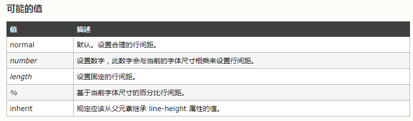

## 序
最近面了很多公司，整理一波常考的知识点

## http

http相关没有特别难的，常见的了解下就没问题。
http1.1 协议里增加了 `keepalive`的支持， 并且默认开启。
[keep-alive](https://www.cnblogs.com/skynet/archive/2010/12/11/1903347.html)

### 1. 介绍`Http2`，优点和存在什么坑或问题（必考）

`http2`在`http/1.1`的基础上保持原有语义和功能不变，但极大的提升了性能。
`http2`整体的优化设计包括以下5个方面

###### 采用二进制格式传输数据
之前的`http1.*`均采用文本格式传输数据，而`http2`则选择了使用二进制格式传输数据。在`http2`中，基本的协议单位是帧，每个数据流均以消息形式发送，消息由一个或多个帧组合而成。帧的内容包括：长度、类型、标记、保留字段、流标识符和帧主体

###### 多路复用
在http`1.0`中，如果需要并发多个请求，则必须创建多个`TCP`连接，并且浏览器对于单个域名的请求有相应的数量限制，一般为6个。连接无法被复用
http1.1中，引入了流水线技术，但先天的FIFO（先进先出）机制导致当前请求的执行依赖于上一个请求执行的完成，容易引起报头阻塞
`http2.0`重新定义了底层的`http`语义映射，允许在同一个连接上使用请求和响应双向数据流。至此，同一个域名只需要占用一个`TCP`连接，通过数据流，以帧为基本协议单位，从根本上解决了这个问题，避免了因频繁创建连接产生的延迟，减少了内存消耗，提升了使用性能

###### 流的优先级
在`HTTP2`中可以为每个流设置优先级，高优先级的流会被服务优先处理并返回客户端，同时，流的优先级允许根据场景的不同进行动态改变。客户端可以在流中设置优先级来改变流的优先级

###### 首部压缩
`http2`引入了`HPACK`压缩首部数据。由于`HPACK`压缩引入了索引表概念，包含静态表和动态表。在同一个请求上产生的响应越多，表的累积会越全面，压缩效果会越好。

###### 服务端推送


2. HTTP报文的请求和返回会有几个部分（请求行、请求头、请求体）；每部分具体都有什么（常见的请求头）
3. GET和POST的区别

###### 表面的区别

1. GET在浏览器回退时是无害的，而POST会再次提交请求。
2. GET产生的URL地址可以被Bookmark，而POST不可以。
3. GET请求会被浏览器主动cache，而POST不会，除非手动设置。
4. GET请求只能进行url编码，而POST支持多种编码方式。
5. GET请求参数会被完整保留在浏览器历史记录里，而POST中的参数不会被保留。
6. get方式提交数据的大小（一般来说1024字节），http协议并没有硬性限制，而是与浏览器、服务器、操作系统有关，而POST理论上来说没有大小限制，http协议规范也没有进行大小限制，但实际上post所能传递的数据量根据取决于服务器的设置和内存大小。
7. 对参数的数据类型，GET只接受ASCII字符，而POST没有限制。
8. GET比POST更不安全，因为参数直接暴露在URL上，所以不能用来传递敏感信息。
9. GET参数通过URL传递，POST放在Request body中。

###### 重大的区别

1. GET产生一个TCP数据包；POST产生两个TCP数据包。
2. 对于GET方式的请求，浏览器会把http header和data一并发送出去，服务器响应200（返回数据）；
3. 而对于POST，浏览器先发送header，服务器响应100 continue，浏览器再发送data，服务器响应200 ok（返回数据）

###### 更深入的区别

get是用来获取服务器信息的，请求报文传输的信息只是用来描述所需资源的参数，返回的信息才是数据本身。
post是用来向服务器传递数据的，请求报文传递的信息就是数据本身，返回的报文只是操作的结果


4. 输入url到页面加载全过程（必考）
5. 介绍HTTPS；HTTP和HTTPS的区别（必考）
6. HTTPS加密过程
7. HTTP缓存控制（强缓存、弱缓存）；缓存相关的HTTP请求头（必考）
8. 对跨域的了解，跨域怎么解决（必考）
9. cors的返回头、cors预请求，什么时候会出发预请求（必考）
10. tcp的长连接和http2多路复用相关
11. tcp拥塞控制和流量控制

12. 三次握手四次挥手，为什么三次和四次
13. 前端性能优化（必考）


## css

css最近问的越来越少了，只要会写常见的布局就ok，难点的答不出来也没事。相比移动端相关的会问题的比较多。

1. 盒模型
2. positon的值，都是根据什么定位（注意下还有sticky）
3. 栅格布局的原理
4. 垂直居中布局
5. 上中下布局，中间自适应
6. 左中右布局，中间自适应
7. 什么css可以减少重绘

### 8. 动画相关属性

##### 过渡动画
```bash
transition-property（过渡的属性的名称）。
transition-duration（定义过渡效果花费的时间,默认是 0）。
transition-timing-function:linear(匀速) ease(慢速开始，然后变快，然后慢速结束)（规定过渡效果的时间曲线，最常用的是这两个）。
transition-delay
```

##### 关键帧动画:通过这个对一个动画的过程的每一部分的表现都做出要求。
一个关键帧动画，最少包含两部分，animation 属性及属性值（动画的名称和运行方式运行时间等）。@keyframes（规定动画的具体实现过程）
animation 属性可以拆分为（当然，我们一般都写一起）
```bash
animation-name 规定@keyframes 动画的名称。
animation-duration 规定动画完成一个周期所花费的秒或毫秒。默认是 0。
animation-timing-function 规定动画的速度曲线。默认是 “ease”，常用的还有linear，同transtion 。
animation-delay 规定动画何时开始。默认是 0。
animation-iteration-count 规定动画被播放的次数。默认是 1，但我们一般用infinite，一直播放。
```

9. 移动端适配方案（必考）
10. 移动端适配1px的问题

### 11. line-height属性1.5和150%区别


其实区别就在于继承的问题上
```javascript
<div style="line-height:150%;font-size:16px;background-colo:yellow;margin:0;">
 <span>第一行</span>
 <p style="margin:0;font-size:36px;">第二行</p>
</div>
```
150%是先计算后继承，根据父元素的字体大小计算出行高，并且子元素依然沿用这个计算后的行高，此时的第一行的行高是：16px*150%=24px，而第二行的行高是继承父元素的值，所以行高为24px。可以看到如果子元素的字体大小大于父元素，就会出现错位等问题。

```javascript
<div style="line-height:1.5;font-size:16px;background-colo:yellow;margin:0;">
 <span>第一行</span>
 <p style="margin:0;font-size:36px;">第二行</p>
</div>
```
设置不带单位的，那它就是个“缩放因子”，后代元素会继承这个缩放因子进行计算，而不是继承父元素计算后的值继承，1.5则是先继承后计算（无单位参数），根据子元素自己字体的大小去乘以1.5来计算行高 ： 这时的第一行行高为：16px*1.5=24px，而第二行的行高先继承了缩放因子再进行计算，行高为：36px*1.5=54px

### 12. em和rem的区别

`em`是相对于父元素，而`rem`是相对于根元素，`rem`定义是根元素的`font-size`，以`rem`为单位，其数值与`px`的关系，需相对于根元素`<html>`的`font-size`计算，比如设置根元素`font-size=16px`，则表示`1rem=16px`；

## js

重中之重，没啥可说的刷题就完事了，而且像节流防抖、bind、promise之类的都要会手写。这里就不标必考了，因为大部分都是重点。

1. 判断数组方法
2. Object.assign和Object.create相关
3. 深拷贝和浅拷贝
4. let、const和var的区别
5. 基本类型和引用类型相关（堆栈）
6. bind, call, apply相关（自己要会实现）
7. 介绍事件循环（宏任务微任务，要知道执行顺序）
8. 定时器为什么不准（有可能会让你实现一个倒计时）
9. 原型介绍
10. 继承方法（手写）

### 11. 闭包介绍和它的作用（手写）
作用：闭包可以让临时变量在外部函数生命周期结束时，仍然存在于内存之中！

### 12. new实现过程

```javascript
//Fn:当前要new的类Dog
//arg:后期需要给构造函数传递的参数信息['三毛']
function _new(Fn,...args){
    let obj = {};
    obj.__proto__ = Fn.prototype;//let obj = object.create(Fn.prototype)
    Fn.call(obj,...args);
    return obj
}
let sanmao = _new Dog(Dog,'三毛')
```
```bash
像普通函数执行一样，形成一个私有的作用域+形参赋值+变量提升
默认创建一个对象
链接到原型
让函数中的this指向这个对象，这个对象就是当前类的一个实例
默认把创建的对象返回
```

### 13. 防抖和节流（手写）
```javascript
//防抖定义:对于短时间内连续触发的事件（上面的滚动事件）,防抖的含义就是让某个时间期限（如上面的1000毫秒）内,事件处理函数只执行一次。
/*
* fn [function] 需要防抖的函数
* delay [number] 毫秒，防抖期限值
*/
function debounce (fn,delay){
    let timer = null;
    return function(){
        if(timer){
            clearTimeout(timer)
        }
        timer = setTimeout(fn,delay);
    }
}

```

```javascript

function throttle(fn,delay){
    let ctx;
    let args;
    let previous = Date.now();  //记录上次触发时间
    let laterFn = function(){
        fn.apply(ctx,args)
    }
    return function(){
        ctx = this;
        args = arguments;
        let now = Date.now();
        if(now - previous >= delay){   //本次触发时间和上次触发时间比较，如果间隔时间超过设定时间，则再次设置触发的定时器
            previous = now;
            setTimeout(laterFn,delay)
        }
    }
}
```

14. 数组去重、扁平化、柯里化
15. this指向
16. es6特性
17. promise介绍（最好会写）
18. promise.all和promise.race介绍（手写）
19. async介绍（了解原理 generator+自执行器）
20. 异步的串行（可以用promise也可以async）
21. 箭头函数指向

### 22. set、map介绍；和数组、对象的区别

#### set基本用法
`ES6` 提供了新的数据结构 `Set`。它类似于数组，但是成员的值都是唯一的，没有重复的值。
`Set`本身是一个构造函数，用来生成 `Set` 数据结构。
向 `Set` 加入值的时候，不会发生类型转换，所以5和"5"是两个不同的值。`Set` 内部判断两个值是否不同，使用的算法叫做“Same-value-zero equality”，它类似于精确相等运算符（===），主要的区别是向 `Set` 加入值时认为NaN等于自身，而精确相等运算符认为`NaN`不等于自身。

#### Set 实例的属性和方法
`Set` 结构的实例有以下属性。
```bash
Set.prototype.constructor：构造函数，默认就是Set函数。
Set.prototype.size：返回Set实例的成员总数。
```

#### Set 实例的方法分为两大类：操作方法（用于操作数据）和遍历方法（用于遍历成员）。下面先介绍四个操作方法。
```bash 
Set.prototype.add(value)：添加某个值，返回 `Set` 结构本身。
Set.prototype.delete(value)：删除某个值，返回一个布尔值，表示删除是否成功。
Set.prototype.has(value)：返回一个布尔值，表示该值是否为`Set`的成员。
Set.prototype.clear()：清除所有成员，没有返回值。
```
#### 遍历操作
`Set` 结构的实例有四个遍历方法，可以用于遍历成员。
```bash
Set.prototype.keys()：返回键名的遍历器
Set.prototype.values()：返回键值的遍历器
Set.prototype.entries()：返回键值对的遍历器
Set.prototype.forEach()：使用回调函数遍历每个成员
```

### Map含义和基本用法
`ES6` 提供了 `Map` 数据结构。它类似于对象，也是键值对的集合，但是“键”的范围不限于字符串，各种类型的值（包括对象）都可以当作键。也就是说，`Object` 结构提供了“字符串—值”的对应，`Map` 结构提供了“值—值”的对应，是一种更完善的 `Hash` 结构实现。如果你需要“键值对”的数据结构，`Map` 比 `Object`更合适。

#### Map实例的属性和操作方法
```bash
size 属性
Map.prototype.set(key, value)
Map.prototype.get(key)
Map.prototype.has(key)
Map.prototype.delete(key)
Map.prototype.clear()
```
#### 遍历方法
`Map` 结构原生提供三个遍历器生成函数和一个遍历方法
```bash
Map.prototype.keys()：返回键名的遍历器。
Map.prototype.values()：返回键值的遍历器。
Map.prototype.entries()：返回所有成员的遍历器。
Map.prototype.forEach()：遍历 Map 的所有成员。
```

### 23. 模块化介绍(commnjs amd cmd umd export)
```bash
目前模块化的解决方案
CommonJS -- Node.js
AMD -- RequireJS
CMD -- SeaJS
UMD
ES6 Module
```

24. localstorage sessionstorage cookie
25. 事件委托

### 26. Proxy和Object.defineProperty

#### 使用Object.defineProperty

`ES5` 提供了 `Object.defineProperty` 方法，该方法可以在一个对象上定义一个新属性，或者修改一个对象的现有属性，并返回这个对象。
```bash
Object.defineProperty(obj, prop, descriptor)
参数：
obj: 要在其上定义属性的对象。
prop: 要定义或修改的属性的名称。
descriptor: 将被定义或修改的属性的描述符。
```
当然一般不会只是改变一个属性,如下所示，遍历劫持对象所有的属性
```javascript
//要劫持的对象
const data = {
    name:''
}
  //遍历对象,对其属性值进行劫持
  Object.keys(data).forEach(function(key){
    Object.defineProperty(data,key,{
        enumerable: true,
        configurable: true,
        get: function() {
            console.log('get');
          },
          set: function(newVal) {
            // 当属性值发生变化时我们可以进行额外操作
            console.log(`我修改了成了${newVal}`);           
          },
    })
  })
  data.name = '王莉娜'
```
##### 缺点：
`Object.defineProperty`的第一个缺陷,无法监听数组变化

##### 区别：
1. `Proxy`可以直接监听对象而非属性
2. `Proxy`直接可以劫持整个对象,并返回一个新对象,不管是操作便利程度还是底层功能上都远强于`Object.defineProperty`。
3. `Proxy`可以直接监听数组的变化
4. `Proxy`有多达13种拦截方法,不限于`apply、ownKeys、deleteProperty、has`等等，这些是`Object.defineProperty`不具备的。


27. 下面的输出结果是NaN，3

```javascript
var a = 1;
function outer(){
	var a = 2;
	function inner(){
	a++;
	console.log(a)
	var a = 3;
	console.log(a)
	}
	inner()
}
outer()
```
## React native
##### ScrollView,FlatList的适用场景及区别。FlatList相对于ListView做了哪些优化？
```bash
ScrollView：渲染数据量少
FlatList：数据量多的
ListView：数据量过大的情况会卡顿（row是持续添加不销毁，导致内存占用大）
FlatList：看不见的元素用空白代替，节省内存渲染快。缺点：滑动太快会有白屏
```


## hybrid
##### 移动端点击事件为什么会有延迟？有哪些方法可以解决？

```bash
原因：等待300ms看用户是点击还是双击缩放
解决方法：禁止缩放，设置默认视口宽度为设备宽度设置css touch-action:none
fastclick.js
```


## jsBridge通信原理
```bash
JavaScript调用native的方式，主要有两种：注入API和拦截URL scheme
注入API方式的主要原理是：通过webview提供的接口，向JavaScript的Context（Window）中注入对象或者方法
，让JavaScript调用时，直接执行相应的Native代码逻辑，达到JavaScript调用Native的目的。
URL scheme是一种类似url的链接，是为了方便app直接互相调用设计的，形式和普通的url类似，主要区别是
protocol和host一般是自定义的，例如：qunarhy://hy/url?url=ymfe.tech，protocol是qunarhy，host是hy。
拦截URL scheme的主要流程是：web端通过某种方式(iframe.src)发送URL Scheme请求，之后Native拦截到请求并根据URL Scheme（包括所带的参数）进行相关操作
Native调用JavaScript，其实就是执行拼接JavaScript字符串，从外部调用JavaScript中的方法，因此JavaScript的方法
必须在全局的Window上。
```


## 算法、数据结构部分

本来以为只有头条、猿辅导之类的公司才考算法，但是最后发现每家公司都会考，可能都想拿算法来做下区分度了吧。不过遇到做不出来的面试官基本也都会给提示，提示完能写出来也没问题。总体来说考的都是常见的题或者变形而来的，把LeetCode或剑指offer里常见的easy题看了就行。数据结构和设计模式问的很少，但是自己也需要总结了解下。

1. 冒泡排序
2. 快速排序
3. 回文字符串
4. 两数之和、k sum
5. 大数相加
6. 二分查找
7. 二叉树前中后遍历
8. 二叉树层次遍历
9. 二叉树深度优先遍历(递归、非递归)
10. 二叉树广度优先遍历(递归、非递归)
11. 和为n的二叉树路径
12. 二叉树深度
13. 二叉树是否对称
14. 链表反转
15. 16进制转10进制


## 项目部分

每个公司都会有项目的介绍，如果你介绍的项目面试官有兴趣的话会很加分，所以一定要认真准备。我一般会介绍之前做的一个前端微服务的架构，项目做了很多优化也比较复杂，感觉算是自己比较加分的部分。

1. 介绍下你项目的难点（房型吸顶）
2. 如果现在再看这个项目你会做哪些优化
3. 根据项目的具体问题
4. 我们项目怎么打包发布部署的？
通过webpack打包，发布到node服务器，pm2监控及负载均衡。
PM2是node进程管理工具，可以利用它来简化很多node应用管理的繁琐任务，如性能监控、自动重启、负载均衡等，而且使用非常简单。
```bash
npm install -g pm2
```

5. 静态资源怎么发布的
a. 简单来说就是文件上传，在不同的区域访问不同的cdn服务器（有cdn中间商来做的，类似七牛云，我们只负责上传就好），
b. 版本控制，目前我们是在请求后面加V=xxxxx或者文件生成的时候使用不同的后缀（类似hash）一些静态资源是日期,也有部分hash；目前也是采用日期的形式
eg:
```javascript
<link
        key="tourplan"
        rel="stylesheet"
        type="text/css"
        href={res.locals.publicPath + '/idiytour/css/tourplan.css?v=' + res.locals.version}
/>,
<link
    key="h5_koala"
    rel="stylesheet"
    type="text/css"
    href={res.locals.publicPath + '/idiytour/css/h5_koala.css?v=' + res.locals.version}
/>,
<link
    key="dp_n"
    rel="stylesheet"
    type="text/css"
    href={res.locals.publicPath + '/idiytour/css/dp_new.css?v=' + res.locals.version}
/>
```

6. 做了哪些性能优化？
。。。

7. rn用了什么脚手架？底层是什么原理？
react-native-cli
讲jsx映射成native组件

8. rn中样式为啥不直接写个object却需要写成stylesheet（{}）这种形式
Instead of creating a new style object every time, StyleSheet helps to create style objects with an ID which is further used to reference instead rendering it again.
Moving code outside the render() helps in achieving the better understanding of code and adds meaning to low-level components.
The stylesheet is sent only once over the bridge unlike normal style object inside render().

9. 怎么和服务端通信的，加密怎么加密的？
采用公钥密码体制RSA算法对数据加密

10. 怎么回滚代码的？
git log -> reset head -> git push -f

11. 你们jest-converage怎么跑到100%的，这个很难，你们怎么做到的？
通过代码覆盖率的检查，分析代码的合理性。删除冗余判断及逻辑，直到覆盖率达到100%

12. grahql你们后端怎么用的
目前后端不使用, 只要针对BFF来做graphql

13. [cdn基本工作过程](https://blog.csdn.net/u014209205/article/details/89892359)