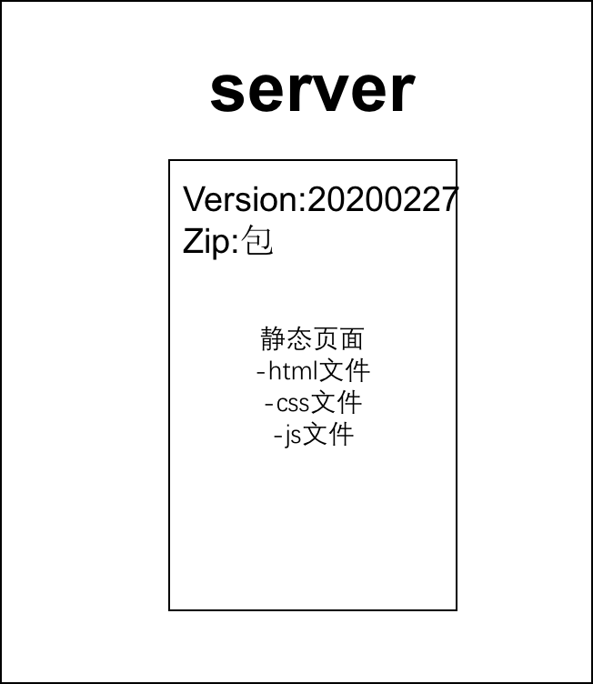
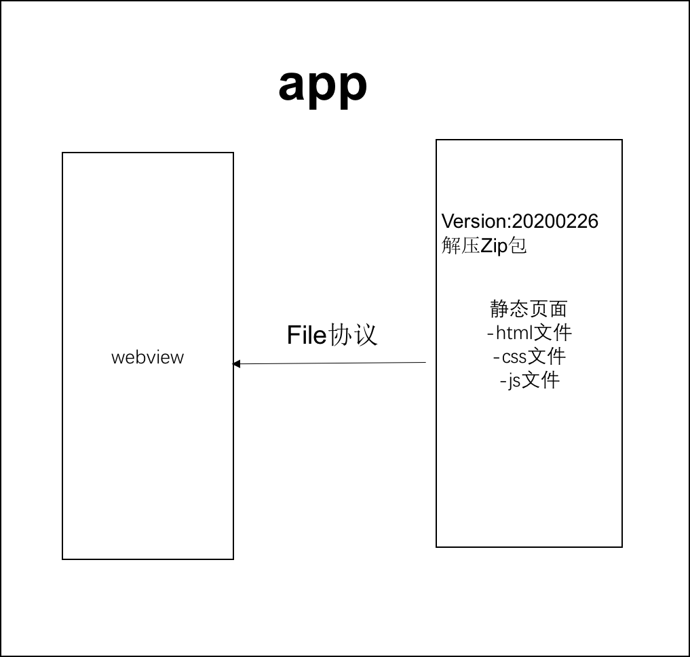
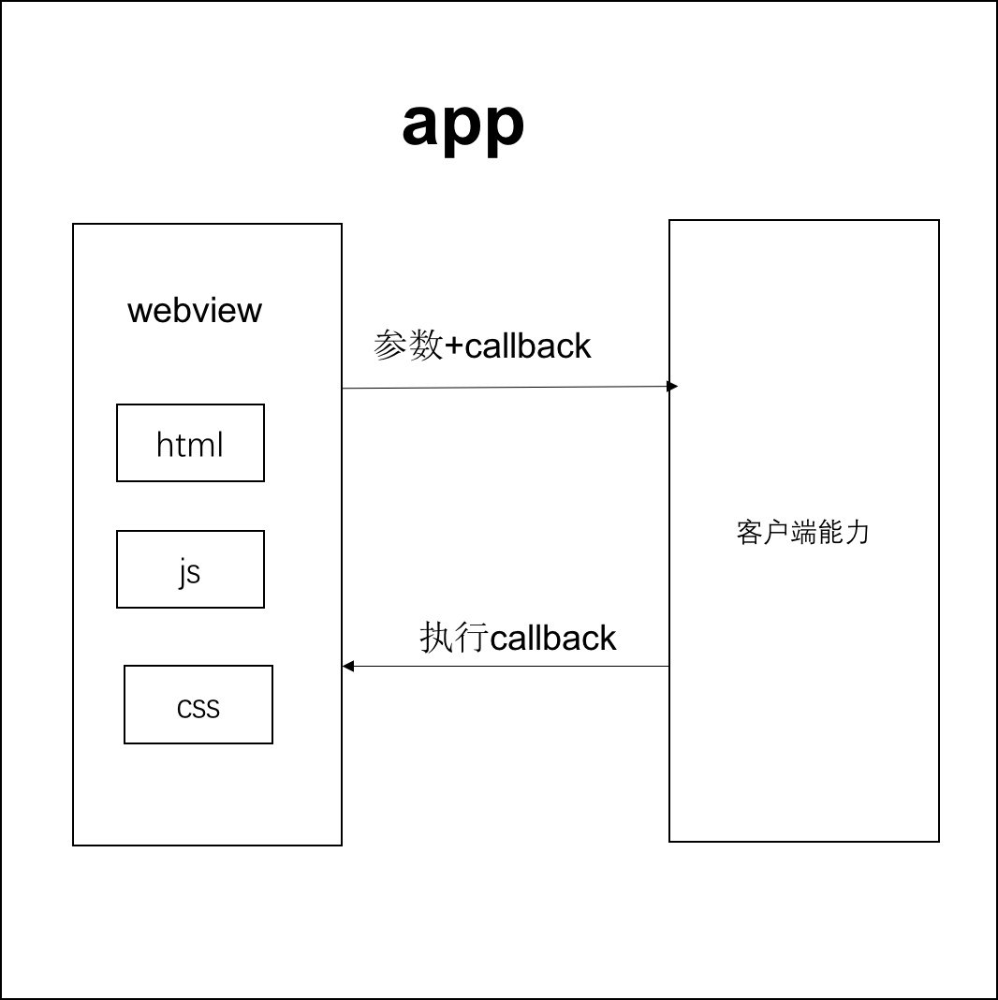

## 序
此章节主要讲解`Hybrid`和`Javascript`之间的秘密

## hrbrid是什么?为何用hybrid?

#### 1. hybrid文字解释
- `hybrid`即'混合',即前端和客户端的混合开发
- 需前端开发人员和客户端开发人员配合完成
- 某些环节也可能涉及到`server`端
- ps.不要以为自己是前端就可以不理会客户端的知识

#### 2. 存在价值,为何用hybrid
- 可以快速迭代更新(无需`app`审核,无需高权限)
- 体验流畅(和`native`的体验基本类似)
- 减少开发和沟通成本,双端公用一套代码

#### 3. webview
- 它是`app`中的一个组件(`app`可以有`webview`,也可以没有)
- 用于加载`h5`页面,即一个小型的浏览器内核

##### 补充：常见的浏览器内核如下：
1. `Chrome,Safari: webkit`
2. `Firefox:Gecko`
3. `IE: Trident`
4. `360`,搜狗等国内浏览器：`Trident+webkit`

#### 4. file协议
【其实在一开始我们就接触`html`开发,就已经使用了`file`协议,只不过当时没有'协议','标准'等这些概念,这里再次强调'协议','标准'的重要性！！！】
##### file协议和http(s)的区别:
1. `file`协议是本地文件,快(断网也可以,打开本地文件即可); 
表示： `"file://"` + 文件绝对路径
2. `http(s)`协议是网络加载,慢(断网不可以);  
表示：`"http(s)://"`

#### 5. hybrid实现流程
- 不是所有场景都适合使用`hybrid`
- 使用`native`:体验要求极致,变化不频繁(如头条的首页)
- 使用`hybrid`:体验要求高,变化频繁(如头条的新闻详情页)
- 使用`h5`:体验无要求,不常用(如举报,反馈等页面)

## 具体实现如下:
1. 前端做好静态页面`(html js css)`,将文件交给客户端
2. 客户端拿到静态页面,以文件形式存储在`app`中
3. 客户端在一个`webview`中(重要！！！)
4. 使用`file`协议加载静态页面(重要！！！)
用如下图表示如下:


## 总结:  
1. `hybrid`是客户端和前端的混合开发
2. `hybrid`存在的核心意义在于快速迭代,无需审核
3. `hybrid`实现流程(如上图),以及`webview`和`file`协议

## 介绍一下hybrid更新和上线的流程
先看下面两张图



要替换每个客户端的静态文件,只能客户端来做(客户端是我们开发的),客户端去`server`下载最新的静态文件,我们维护`server`的静态文件

#### 客户端和server先对比版本,如果一致客户端没必要重新下载(不做无谓的下载)
- 分版本,有版本号,如`20200227`(时间戳)
- 将静态文件压缩成`zip`包上传到服务器
- 客户端每次启动,都去服务端检查版本号
- 如果服务端版本号大于客户端版本号,就去下载最新的`zip`包
- 下载完之后解压包,然后将现有文件覆盖

## 总结: 
要点1.掌握流程图
要点2.服务端的版本和`zip`包维护
要点3.更新`zip`包之前先对比版本号
要点4.`zip`包下载解压和覆盖

## hybrid和h5的主要区别

#### 1.优点:
- 体验更好,跟`native`体验基本一致
- 可快速迭代,无需审核(关键)

#### 2.缺点:
 - 开发成本高,联调,测试,查`bug`都比较麻烦
 - 运维成本高,可参考此前讲过的更新上线的流程

#### 3.适用的场景:
 - `hybrid`: 产品的稳定功能,体验要求高,频繁迭代
 - `h5`: 单次的运营活动(如xx红包)或不常用功能


## 总结:
- 优点: 体验好,可快速迭代
- 缺点: 开发成本高,运维成本高
- 适用的场景: `hybrid`适合产品型,`h5`适合运营型

## 前端js和客户端如何通讯？
 ### 1. js和客户端通讯的基本技术
 #### js和客户端通讯的基本形式(见下图)
 

 - `js`访问客户端能力,传递参数和回调函数
 - 客户端通过回调函数返回内容

### 2.遗留问题:新闻详情页适用hybrid(file协议),前端如何获取到新闻内容？
 1. 不能用`ajax`获取(`http`协议):第一跨域,第二速度慢。
 2. 客户端获取新闻内容后然后通过`js`通讯拿到内容,再渲染。

#### schema协议简介和适用 
`schema`协议：前端和客户端的约定
eg：
微信`schema`格式：`"weixin://"`
`QQ schema`协议格式：`"QQ://"`
#### schema使用的封装

#### 简单版
 ```javascript
 var iframe = document.createElement('iframe')
 iframe.style.display = 'none'
 //iframe访问schema（重要！！！）
 iframe.src = 'weixin://dl/scan?k1=v1&k2=v2&k3=v3&callback=_weixin_scan_callback'    
 

 var body = document.body || document.getElementsByTagName('body')[0]
 body.appendchild(iframe)
 setTimeout(function(){
     body.removeChild(iframe)  //销毁iframe
     iframe = null
 })

//如果要加上参数和callback，那么就必须要这么写
 window['_weixin_scan_callback'] = function(result){
     alert(alert)
 }
```

#### 封装版

 ```javascript
 
 window.invoke.share({title:'xxx',content:'xxx'},function(result){
     if(result.errno === 0) {
         alert('分享成功！')
     }else{
         alert('分享失败！',result.message)
     }
 })
//分享
 function invokeShare(data,callback){
     _invoke('share',data,callback)
 }
 //登录
 function invokeLogin(data,callback){
    _invoke('login',data,callback)
 }
 //扫一扫
 function invokeScan(data,callback){
     _invoke('scan',data,callback)
 }
//暴露给全局
 window.invoke = {
     share:invokeShare,
     login:invokeLogin,
     scan:invokeScan
 }

 function _invoke(action,data,callback){
     var schema = 'myapp://utils'
     schema += '/' + action
     schema += '?a=a'
     var key
     for(var key in data){     //data={title:'xxx',content:'xxx'}
         if(data.hasOwnProperty(key)){
             schema += '&' + key + '=' + data[key]
         }
     }
 }

 //处理callback
 var callbackName = ''
 if(typeof callback === 'string'){
     callbackName = callback
 }else{
     callbackName = action + Date.now()
     window[callbackName] = callback
 }

 schema += '&callback='+ callbackName
 //iframe调用schema
 此处省略N行


 (function(window,undefined){
     function _invoke(action,data,callback){
         //拼接schema的封装
         var schema = 'myapp://utils' + action
         schema += '?a=a' //拼接参数
         window.invoke = {
             share:function(data,callback){
                 _invoke('share',data,callback)
             },
             scan:function(data,callback){
                 _invoke('scan',data,callback)
             },
             login:function(data,callback){
                 _invoke('login',data,callback)
             }
         }
     }
 })
```
#### 内置上线


## 总结
1. 通讯的基本形式： 调用能力，传递参数，监听回调
2. 对`schema`协议的理解和使用
3. 调用`schema`代码的封装
4. 内置上线的好处：更快，更安全


 
 


