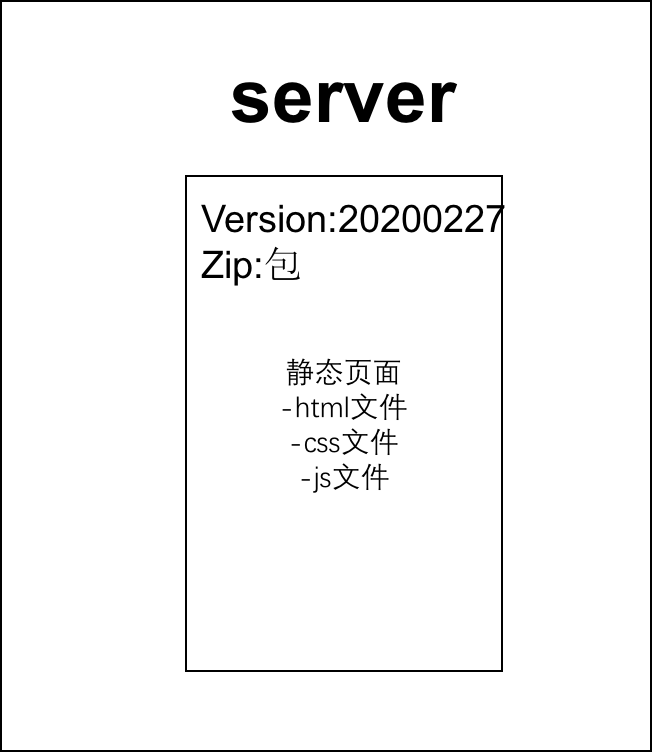
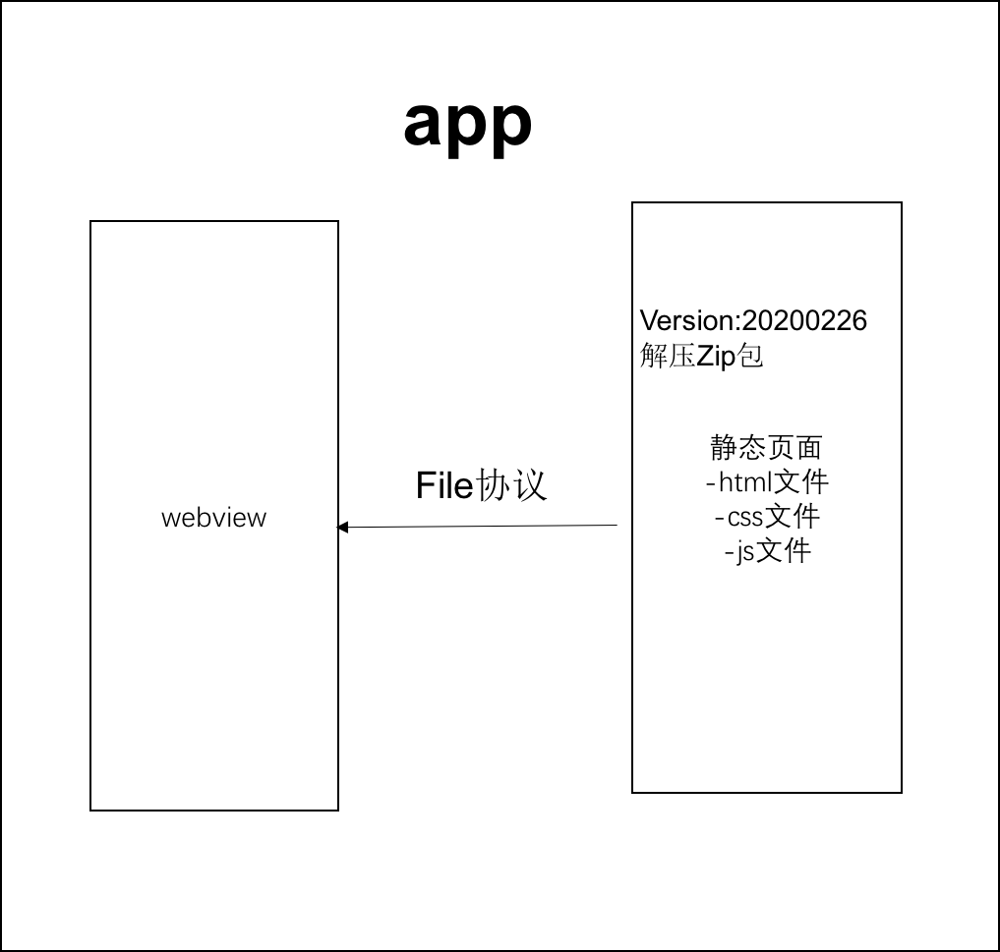

## 序
此章节主要讲解Hybrid和javascript之间的秘密

## hrbrid是什么?为何用hybrid?

#### 1. hybrid文字解释
- hybrid即'混合',即前端和客户端的混合开发
- 需前端开发人员和客户端开发人员配合完成
- 某些环节也可能涉及到server端
- ps.不要以为自己是前端就可以不理会客户端的知识

#### 2. 存在价值,为何用hybrid
- 可以快速迭代更新(无需app审核,无需高权限)
- 体验流畅(和native的体验基本类似)
- 减少开发和沟通成本,双端公用一套代码

#### 3. webview
- 它是app中的一个组件(app可以有webview,也可以没有)
- 用于加载h5页面,即一个小型的浏览器内核

#### 4. file协议
【其实在一开始我们就接触html开发,就已经使用了file协议,只不过当时没有'协议','标准'等这些概念,这里再次强调'协议','标准'的重要性!!!】
> #### file协议和http(s)的区别:
- a. file协议是本地文件,快(断网也可以,打开本地文件即可); 
- b. "file://" + 文件绝对路径
- a. http(s)协议是网络加载,慢(断网不可以);  
- b. "http(s)://"

#### 5. hybrid实现流程
- 1.不是所有场景都适合使用hybrid
- 2.使用native:体验要求极致,变化不频繁(如头条的首页)
- 3.使用hybrid:体验要求高,变化频繁(如头条的新闻详情页)
- 4.使用h5:体验无要求,不常用(如举报,反馈等页面)

## 具体实现如下:
- 前端做好静态页面(html js css),将文件交给客户端
- 客户端拿到静态页面,以文件形式存储在app中
- 客户端在一个webview中(重要!!!)
- 使用file协议加载静态页面(重要!!!)
用如下图表示如下:

> #### 总结:  
1. hybrid是客户端和前端的混合开发
2. hybrid存在的核心意义在于快速迭代,无需审核
3. hybrid实现流程(如上图),以及webview和file协议

## 介绍一下hybrid更新和上线的流程
先看下面两张图

要替换每个客户端的静态文件,只能客户端来做(客户端是我们开发的),客户端去server下载最新的静态文件,我们维护server的静态文件

#### 客户端和server先对比版本,如果一致客户端没必要重新下载(不做无谓的下载)
- 分版本,有版本号,如20200227(时间戳)
- 将静态文件压缩成zip包上传到服务器
- 客户端每次启动,都去服务端检查版本号
- 如果服务端版本号大于客户端版本号,就去下载最新的zip包
- 下载完之后解压包,然后将现有文件覆盖

> #### 总结: 
要点1.掌握流程图
要点2.服务端的版本和zip包维护
要点3.更新zip包之前先对比版本号
要点4.zip包下载解压和覆盖

## hybrid和h5的主要区别
 #### 1.优点:
- 体验更好,跟native体验基本一致
- 可快速迭代,无需审核(关键)
#### 2.缺点:
 - 开发成本高,联调,测试,查bug都比较麻烦
 - 运维成本高,可参考此前讲过的更新上线的流程
#### 3.适用的场景:
 - hybrid: 产品的稳定功能,体验要求高,频繁迭代
 - h5: 单次的运营活动(如xx红包)或不常用功能

> #### 总结:
- 优点: 体验好,可快速迭代
- 缺点: 开发成本高,运维成本高
- 适用的场景: hybrid适合产品型,h5适合运营型

## 前端js和客户端如何通讯？
 ### 1. js和客户端通讯的基本技术
 #### js和客户端通讯的基本形式(见下图)
 

 -   js访问客户端能力,传递参数和回调函数
 -   客户端通过回调函数返回内容

### 2.遗留问题:新闻详情页适用hybrid(file协议),前端如何获取到新闻内容？
  

 1. 不能用ajax获取(http协议):第一跨域,第二速度慢。
 2. 客户端获取新闻内容后然后通过js通讯拿到内容,再渲染。
 
 
 -  schema协议简介和适用 
 -  schema使用的封装 
 -  内置上线  
 

